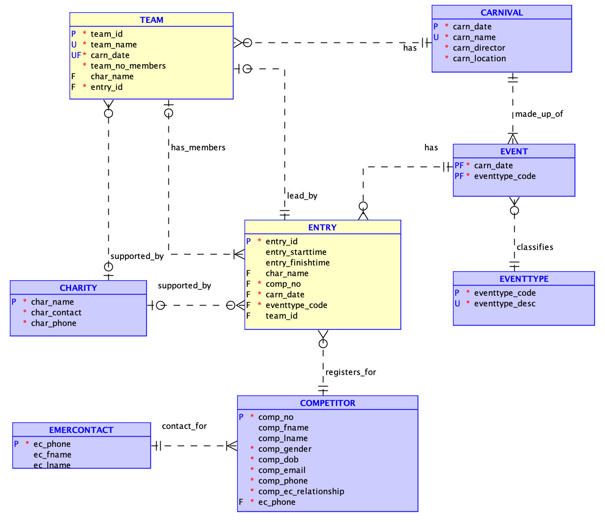
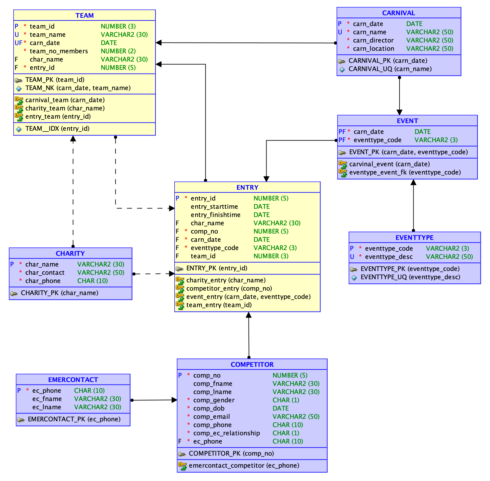

# cityRun_SQL_db
City Run (CR) SQL Relational Database Project (individual)

Project completed using Oracle SQL Developer

Grade: HD

Contents:
- [Section 1: CR Assignment Brief](#1-city-run-cr-assignment-brief)
- [Section 2: CR Logical and Relational Models](#2-logical-and-relational-models-provided)
- [Section 3: CR Assignment Tasks](#3-cr-project-tasks)
   - Task 1 (not included)
   - [Task 2: Data Insert](#task-2-data-insert-10-marks)
   - [Task 3: Data Manipulation](#task-3-data-manipulation-10-marks)
   - [Task 4: SQL Queries](#task-4-sql-queries-46-marks)
   - [Task 5: Design Modifications](#task-5-design-modifications-13-marks)
   - [Task 6: Non-Relational DB Queries - MongoDB](#task-6-non-relational-database-queries-mongodb-10-marks)

.sql files in this repository are named in relation to tasks 1-6, e.g. T1_, T2_, T3_, etc.
Each task and sub-task is outlined and described in contents section 3, under its respective task number.

## 1. City Run (CR) Assignment brief

City Run (CR) is a running carnival which is held on separate dates at various capital cities in Australia during different seasons (Summer, Autumn, Winter and Spring) of the year. 
The carnival naming convention that City Run uses is CR <season name> Series <city name> <year>. 
So, for example, a carnival to be held during the Summer season in Melbourne in 2024 will be named as CR Summer Series Melbourne 2024.

Anyone can attend a CR Carnival, the carnivals are open to all members of the public. A carnival is run on a particular date, in a particular location and only lasts for one day. 
CR only runs one carnival on any particular date. During a carnival a range of events are offered from the following list (only some may be offered):

- Marathon 42.2 Km
- Half Marathon 21.1 Km
- 10 Km Run
- 5 Km Run
- 3 Km Community Run/Walk

City Run expects to offer around 10 - 20 such events across all carnivals in a given year.

When a competitor initially registers for City Run, they are assigned a unique competitor number. 
A competitor is required to provide details of an emergency contact at the time of registration. 
The relationship to the competitor can be Parent (P), Guardian (G), Partner (T) or Friend (F).

When a carnival is being offered, City Run contacts all registered competitors and provides details of the carnival date and what events are on offer. 
Competitors can enter for only one event within a carnival. Every entry is assigned a unique entry id (e.g. 3021). 
Using official timing devices at the carnival, City Run records the entrants starting and finishing times.

A major focus of the City Run Carnivals is to raise funds for various charities. 
When a competitor enters an event, they may nominate a charity for which they will raise funds (not all competitors will select a charity for each event they enter). 
Competitors who have entered the carnival can also form teams with other competitors, whom they know and who have entered the carnival, to support their training and run as a group. 
The first competitor to register a team for a given carnival is assigned as the Team Manager. 
Teams are identified by a unique team name which the team manager must select when they first create the team. 
This team manager can then add/invite other competitors from the carnival to join their team. 
Team names are unique only within a given carnival, A given team name may be reused by different competitors in a different carnival 
as teams are recreated for each carnival depending on which competitors have entered an event for the carnival. 
City Run wishes to record, as part of the stored data, how many members are on each team. 
Teams may also nominate a charity for which they will raise funds, although not all teams will do so. All charities for which funds can be raised must first be approved by City Run.

Note that an individual competitor may be supporting a charity as an individual and also the same or a different charity as a team member.

## 2. Logical and Relational models (provided):

## 3. CR Project Tasks

### Task 1: Relational Database Queries - Relational Algebra (6 marks):

### Task 2: Data Insert (10 marks):

You may need to rerun the schema (cr-schema-insert.sql), especially when you have been experimenting with your solutions and may have corrupted the database unintentionally. If you suspect that there might be such problems, simply rerun the schema. The schema includes the appropriate drop commands at the head of the file.

Load selected tables with your own additional test data: using the supplied T2-cr-insert.sql script file, code the SQL commands which will insert, as a minimum, the following sample data into the yellow coloured relations in the logical model:
- 20 ENTRIES
- 5 TEAMS

Please note, these are the minimum number of entries you must insert; you are encouraged to insert more to provide a richer data set to draw from and to validate your queries in task 4. For this task only, data that you add in the database should follow the rules mentioned below:

1. You may treat all of the data that you add as a single transaction since you are setting up the initial test state for the database..
2. The primary key values for this data should be hardcoded values (i.e., NOT make use of sequences) and must consist of values below 100.
3. The entries and teams must be spread across at least three carnivals which have been completed. Within a given carnival at least two different events must be used.

For this task ONLY, you can look up and include values for the loaded tables/data directly where required. However, if you wish, you can still use SQL to get any non-key values. You are reminded again that in carrying out this task you must not modify any data or add any further data to the tables which were previously populated by the supplied schema file.

### TASK 3: Data Manipulation (10 marks)

For the following tasks, your SQL must correctly manage transactions and use sequences to generate new primary keys for numeric primary key values (under no circumstances may a new primary key value be hard coded as a number or value). Your answers for these tasks must be placed in the supplied SQL Script T3-cr-dml.sql.

a. Create sequences (one for use per table) to provide primary keys for data entry into the following tables:
- COMPETITOR
- ENTRY
- TEAM
The sequences must begin at 100 and go up in steps of 1 (i.e., the first value is 100, the next 101, etc.).
    
b. Brigid Radcliffe, who has previously registered at City Run, has contacted the organisation and indicated she would like to run as a competitor in the "CR Summer Series Melbourne 2024" carnival. She would like to enter the "21.1 Km Half Marathon" event. You may assume that Brigid's phone number 1234567890, is unique in the current competitor data. She has indicated, for this carnival, that she will raise funds to support the "Amnesty International" charity.
Make these changes to the data in the database. This entire registration should be treated as a single transaction.

c. A few weeks later Brigid Radcliffe emails the City Run organisers and reports that she has suffered an injury in training and would like to change her entry (called downgrading) for the "CR Summer Series Melbourne 2024" carnival from the "21.1 Km Half Marathon" to the "10 Km Run". You may assume that Brigid's phone number 1234567890, is unique in the current competitor data. She also indicates that she would like to form a team called "Kenya Speedstars" for this carnival. City Run staff check and confirm that the team name is not currently in use for this carnival, so inform her that such a team can be created. The new team will support the "Beyond Blue" charity.
Make these changes to the data in the database. These changes must be treated as a single transaction.

d. The following week Brigid Radcliffe emails the City Run organisers and reports that her injury has got a lot worse and that she will need to withdraw from the "CR Summer Series Melbourne 2024" carnival. Although she has asked a few friends to join her team for this carnival she is not sure if any have actually taken up the offer; it is possible some have. She did direct that her team, "Kenya Speedstars", should be disbanded. Brigid Radcliffe indicated that she is looking forward to competing in the next 2024 carnival. You may assume that Brigid's phone number 1234567890, is unique in the current competitor data.
Make these changes to the data in the database. These changes must be treated as a single transaction.

### Task 4: SQL Queries (46 marks):

Your answers for these tasks must be placed in the supplied SQL Script T4-cr-queries.sql 

You are reminded that you must design your test data so that you always get output for your SQL queries and thus test them appropriately - this may require you to add further data as you move through completing the required tasks. Such extra data MUST be added as part of Task 2 (ie. as part of your load of test data). Queries that are correct but do not produce any output (“no rows selected” message) using your test data will lose 50% of the marks allocated. Where a question indicates "Your output must have the form shown below" - this means the same appearance and alignment of columns/data as the sample output shows. Clearly your actual data may be different.

In any query where the sort order (descending or ascending) is not specified, you should use the system default.

a. List the first name and the last name of the runners who have registered using a Gmail email address of the form 'gmail.com' in carnivals organised by City Run. 

The listing must include 
- the date of the carnival(s),
- the name of the carnival(s),
- the event description of the event(s) joined for the carnival(s), and
- the first name and last name of the runners as a single column called fullname.

The listing should be displayed in ascending order of the carnival date and runner's full name within a carnival. 

b. List all registered runners who registered to support a charity as an INDIVIDUAL for the '42.2 km Marathon' event.

The listing must include:
- the carnival date,
- the first name and last name of the runner as a single column called runner,
- the charity name,
- the charity contact person, and
- the full description of the supported event in which the runner is running

order the listing in ascending order of carnival date, within a carnival order by the charity name and then by the runner's full name within a supported charity

c. List the number of events all competitors have completed over the previous two calendar years. For example if this report is run in 2023 it should show the events completed for 2022 (the last calendar year) and 2021 (two calendar years back). To allow this to occur dates must not be hardcoded as actual values.

The listing must include
- the competitors number,
- the competitors first name,
- the competitors last name,
- the competitors gender,
- how many events they entered two calendar years back,
- how many events they entered for the previous calendar year, and
- how many events they entered across these two previous calendar years. If they have entered no events for the two years, display 'Completed No Runs'

order the listing to show those who have completed no runs first, and for each of the two groups (those who have completed some runs and those who have completed no runs) by competitor number. 

d. List the total number of entries/participants in the "5 Km Run" for each carnival held in the year 2023.

The listing must include:
- the date of the carnival,
- the carnival name, and,
- the total number of entries/participants in the carnival for this event. Name the column as total_entries5Km

Order the listing in descending order of total number of entries, if several carnivals have the same number of entries they should be ordered with the group in ascending carnival date order. 

e. For all carnivals which have been run by City Run (i.e. the carnival has been finished),  list those events which have had no entries.

The listing must include
- the date of the carnival,
- the carnival name,
- the event description

order the output by event description within the carnival date. 

f. List the team details for each carnival where the most popular team name/s (the team name/s used most often across all carnivals) have been used.

The listing must include
- the team name,
- the date of the carnival,
- the team leaders competitor number as four digits and the first name and last name of the team leader as a single column called TEAMLEADER, and
- the number of members in the team

order the output by the team name and within the team name by carnival date.

### Task 5: Design Modifications (13 marks):

Your answers for these tasks must be placed in the supplied SQL Script T5-cr-mods.sql 

These tasks should be attempted only after task 2, 3 and 4 have been successfully completed. They are to be completed on the "live" database ie. the database with the data loaded from your previous work. . 

In completing this task, you must:
- if you need to add new columns, tables or related constraints, follow the naming conventions used in the data models and schema file which have been provided,
- provide column comments for any new columns that you add, and
- correctly manage any transactions used as part of your solution

a. City Run organisers have noted that several competitors have enrolled in multiple events in the same carnival which they do not wish to occur. Change the database structure to prevent a competitor from enrolling in two events for the same carnival.

b. City Run has decided that they would like to have the elapsed time (finish time - start time) for a runner in a particular event stored as part of the system, rather than having to calculate it every time it is required.
Add a new attribute which will record the runner's elapsed time in an event. The time should be stored as the number of minutes elapsed to two decimal places e.g. 26.12.
This attribute must be initialised to the correct elapsed time based on the data which is currently stored in the system. You should note that the system may contain registrations for future events which currently do not have either a start or finish time.

c. When an emergency contact has been required to be contacted due to a problem with a competitor, there have been several instances of where the listed emergency contact has not been able to be contacted. To help alleviate this issue, City Run would like to be able to have a competitor, if they choose to do so, nominate more than one emergency contact.
Change the database structure to allow this to occur.

### TASK 6: Non Relational Database Queries - MongoDB (10 marks)

Your answers for this task (Task 6) must be placed in the supplied sql file T6a-cr-json.sql and the supplied MongoDB script file T6b-cr-mongo.mongodb.js

a. Write an SQL statement in T6a-cr-json.sql to generate a collection of JSON documents using the following structure/format from the City Run tables used in tasks 4 and 5 (code/run this after task 5). Each document in the collection represents an event in a particular carnival and contains the entry details for that event. The document identifier (_id) is made up of the date of the event in the form ddmmyyyy and the event type code separated by an underscore e.g. "19092021_10K"

b. Create a new collection named events and insert all documents generated in Task 6 (a) above into MongoDB in this collection.

c. List all events which have been inserted in (b)

d. List all events which have more than two participants and which are of type 10K. Display the carnival date, the location, the number of competitors and for all competitors registered their competitor number and name.

e. The carnival on the "01-Feb-2023" was moved to "Lake Gillawarna, Georges Hill, 2198" The location was not entered correctly in the database. Correct the necessary documents using a single MongoDB command. After correction use an appropriate db.find command to confirm the change was successful.
